# LubeRight — Technical & Architecture Report

**Project:** LubeRight — Crane Lubrication Tracking System
**Client context:** Marsa Maroc (port crane maintenance)
**Document type:** Reverse-engineering / architecture report (PFE)
**Stack:** Spring Boot 3.3.3 (Java 17) ×2 · React 19 + TypeScript + Vite · Microsoft SQL Server

---

## Table of Contents

1. [Executive Summary](#1-executive-summary)
2. [Problem Statement & Context](#2-problem-statement--context)
3. [Global Architecture](#3-global-architecture)
4. [Technology Stack](#4-technology-stack)
5. [Use Case Model](#5-use-case-model)
6. [Domain Model & Class Diagrams](#6-domain-model--class-diagrams)
7. [Database Design](#7-database-design)
8. [REST API Reference](#8-rest-api-reference)
9. [Sequence Diagrams (Workflows)](#9-sequence-diagrams-workflows)
10. [Frontend Architecture](#10-frontend-architecture)
11. [Business Logic & Rules](#11-business-logic--rules)
12. [Resilience, Security & Configuration](#12-resilience-security--configuration)
13. [Code Metrics](#13-code-metrics)
14. [Strengths, Weaknesses & Recommendations](#14-strengths-weaknesses--recommendations)
15. [Glossary](#15-glossary)

---

## 1. Executive Summary

LubeRight is a **lubrication/greasing maintenance-tracking system** for the port cranes of Marsa Maroc. A maintenance technician opens an interactive technical diagram of a crane, clicks a lubrication point, and instantly sees whether that point has received its planned amount of grease — color-coded **green / orange / red**.

The defining architectural constraint is that the **source industrial database is read-only and potentially remote/unreliable**. The system therefore never queries it live. Instead, a dedicated reader service periodically synchronizes the data into a **local cache database**, from which the frontend is served. Data flows in a single direction:

> **Source SQL Server → `remote-api` → `Backend` (cache) → `Frontend`**

The solution is composed of **three independently deployable services** and demonstrates production-minded engineering: incremental synchronization with a timestamp watermark, non-overlapping scheduled jobs, automatic retry/reconnection, an idempotent self-migrating schema, and a sophisticated configuration-driven interactive-diagram engine on the frontend.

---

## 2. Problem Statement & Context

### 2.1 Business need
Marsa Maroc operates a fleet of port cranes (KRANBAU, ARDELT, TUKAN, TEREX, REGIANNE). Each crane has dozens of lubrication points spread across subsystems (translation, rotation, boom luffing / *relevage*, hoisting / *levage*, cable pulleys / *poulies*). Maintenance teams must know, per point:
- the **planned** grease amount and frequency,
- the **actual** amount applied,
- whether the point is **under-serviced** (critical).

### 2.2 Technical constraints
| Constraint | Consequence in the design |
|---|---|
| Source DB (`Admin`, `Calender`) is owned by an existing system and must not be modified | A separate **cache database** is introduced; source tables are read-only |
| Source DB may be remote / intermittently reachable | Live querying is avoided; data is **synchronized** on a schedule |
| Backend may start before/after the reader | Reader **retries** until the backend is reachable |
| UI must always feel responsive | Frontend reads only from the **local cache**, never the source |

### 2.3 Design response
A **read-replica / cache-and-sync** architecture: one service reads the source incrementally and pushes batches to a second service that owns a local cache and serves the frontend.

---

## 3. Global Architecture

### 3.1 Component diagram

```mermaid
graph LR
    subgraph SRC["Source System (existing)"]
        DBSRC[("SQL Server SOURCE<br/>dbo.Admin · dbo.Calender")]
    end

    subgraph RA["remote-api · Spring Boot :8082"]
        RAJOB["ScheduledSyncService<br/>startup + every 3h + retry 5s"]
        RASVC["LubricationPointService"]
        RACLIENT["BackendSyncClient (RestClient)"]
        RACTL["LubricationPointController<br/>/api/data · /api/calender/history"]
    end

    subgraph BE["Backend · Spring Boot :8081"]
        SYNCCTL["SyncController<br/>/api/sync/*"]
        DSS["DataSyncService"]
        LPCTL["LubricationPointController<br/>/api/lubrication/latest/{name}"]
        LPSVC["LubricationPointService"]
        DBCACHE[("SQL Server CACHE<br/>snapshot tables")]
    end

    subgraph FE["frontend/App_Marsa · React+Vite :5173"]
        UI["Interactive diagrams + Fleet dashboard"]
    end

    DBSRC -->|JDBC incremental read| RASVC
    RAJOB --> RASVC --> RACLIENT
    RACLIENT -->|GET /api/sync/state<br/>POST /api/sync/batch| SYNCCTL
    SYNCCTL --> DSS --> DBCACHE
    LPCTL --> LPSVC --> DBCACHE
    UI -->|GET /api/lubrication/latest/{name}<br/>via Vite proxy| LPCTL
```

### 3.2 Responsibilities

| Service | Port | Responsibility |
|---|---|---|
| **remote-api** | 8082 | Reads the source SQL Server incrementally; pushes batches to the Backend; runs the sync scheduler. |
| **Backend** | 8081 | Owns the cache DB; ingests batches; serves lubrication data to the frontend; tracks sync state. |
| **frontend/App_Marsa** | 5173 | React SPA: interactive crane diagrams, fleet dashboard, status visualization. |

### 3.3 Key principle — unidirectional data flow
The frontend never reaches the source DB, and the Backend never reaches the source DB. Only `remote-api` touches the source, and only via read queries. This isolation is the project's strongest architectural property.

---

## 4. Technology Stack

| Layer | Technology | Version |
|---|---|---|
| Reader service (`remote-api`) | Spring Boot, Spring Data JPA, HikariCP, mssql-jdbc, Spring Scheduling, RestClient | 3.3.3 / Java 17 |
| Cache & API (`Backend`) | Spring Boot, Spring Data JPA, Actuator, Bean Validation, `spring.sql.init` | 3.3.3 / Java 17 |
| Frontend | React, React Router, TypeScript, Vite, lucide-react | React 19 · TS 5.9 · Vite 8 (beta) · Router 7 |
| Database | Microsoft SQL Server (two databases: source + cache) | — |
| Config | `.env` files (externalized secrets), Maven, npm | — |

---

## 5. Use Case Model

### 5.1 Use case diagram

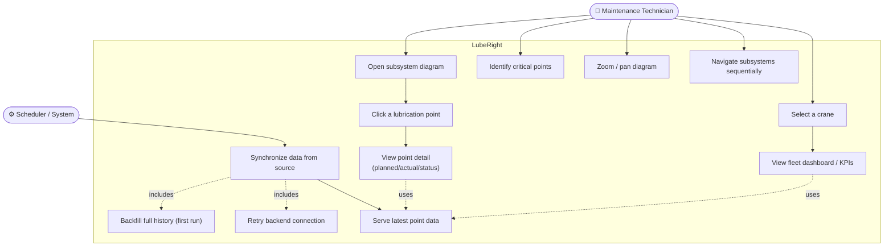

### 5.2 Use case specifications (selected)

**UC4–UC5 — View lubrication point status**
- **Actor:** Technician
- **Precondition:** Cache contains data for the point; backend is running.
- **Main flow:** Technician clicks a marker → frontend resolves DB name candidates → polls `GET /api/lubrication/latest/{name}` → displays planned vs actual amount, interval, and computed status color.
- **Alternate:** 404 → frontend tries the next candidate name; if all fail, shows an error with retry.

**UC9 — Synchronize data from source**
- **Actor:** Scheduler (system, no human).
- **Trigger:** Application ready event, then every 3 hours (`fixedDelay`), plus a 5 s retry loop while the backend is unavailable.
- **Main flow:** Request sync state from backend → compute `updatedAfter` watermark → read latest snapshots + calender history from source → POST batch to backend → backend upserts and advances the watermark.
- **Alternate:** Backend unreachable → mark unavailable, log, retry every 5 s until restored.

---

## 6. Domain Model & Class Diagrams

### 6.1 Backend — class diagram (cache + API)

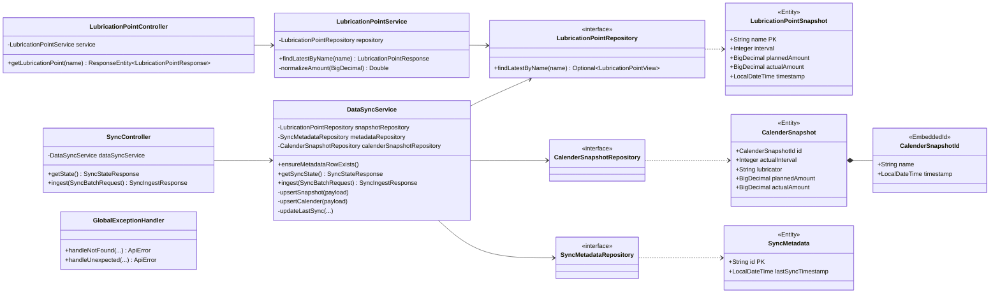

### 6.2 remote-api — class diagram (reader + sync scheduler)

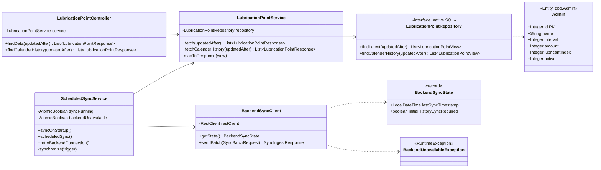

### 6.3 Data Transfer Objects (shared contract by convention)

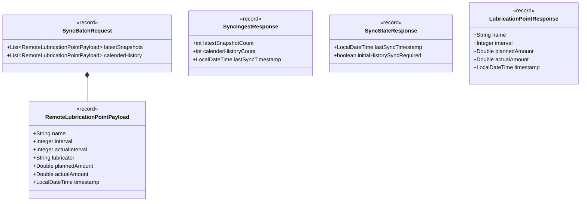

> **Note:** `remote-api` and `Backend` each declare their own copy of these DTOs. They are kept JSON-compatible so the batch POST deserializes correctly across the service boundary. This is intentional decoupling but introduces a maintenance coupling that must be respected.

---

## 7. Database Design

### 7.1 Source database (read-only, pre-existing)
- **`dbo.Admin`** — catalog of lubrication points (`Index` PK, `Name`, `Interval`, `Amount`, `LubricantIndex`, `Active`).
- **`dbo.Calender`** — time-stamped lubrication events (`Index`, `AdminIndex` FK, `ActualInterval`, `Lubricator`, `PlannedAmount`, `ActualAmount`, `TimeStamp`).

### 7.2 Cache database (owned by Backend)

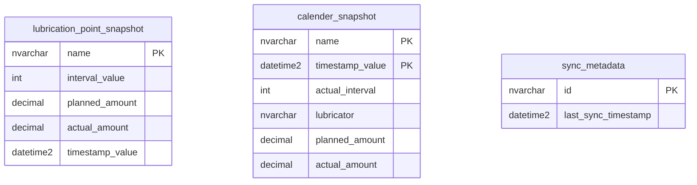

| Table | Role |
|---|---|
| `lubrication_point_snapshot` | "Latest state per point" projection — what the frontend reads. PK = `name`. |
| `calender_snapshot` | Full lubrication history. Composite PK = (`name`, `timestamp_value`). Feeds analytics/history. |
| `sync_metadata` | Single row (`id = 'lubrication-sync'`) holding the incremental watermark `last_sync_timestamp`. |

### 7.3 Schema initialization
`schema.sql` is **idempotent T-SQL** auto-run at backend startup via `spring.sql.init`. It guards every `CREATE TABLE` with `IF NOT EXISTS` and performs additive `ALTER TABLE ... ADD COLUMN` migrations (e.g. adding `lubricator`, `planned_amount`). A custom statement separator `;;` keeps multi-statement `IF...BEGIN...END` batches intact. This effectively serves as a lightweight migration mechanism.

---

## 8. REST API Reference

### 8.1 Backend (`:8081`)

| Method | Path | Request | Response | Purpose |
|---|---|---|---|---|
| `GET` | `/api/lubrication/latest/{name}` | path `name` (NotBlank) | `LubricationPointResponse` | Latest state for one point. Headers: `no-store`, `Pragma`, `Expires: 0`. |
| `GET` | `/api/sync/state` | — | `SyncStateResponse` | Returns watermark + `initialHistorySyncRequired`. |
| `POST` | `/api/sync/batch` | `SyncBatchRequest` | `SyncIngestResponse` | Ingests snapshot + history batch; advances watermark. |
| `GET` | `/actuator/health` | — | health JSON | Liveness/health. |

### 8.2 remote-api (`:8082`)

| Method | Path | Request | Response | Purpose |
|---|---|---|---|---|
| `GET` | `/api/data` | query `updatedAfter?` (ISO datetime) | `List<LubricationPointResponse>` | Manual/debug read of latest-per-point from source. |
| `GET` | `/api/calender/history` | query `updatedAfter?` | `List<LubricationPointResponse>` | Manual/debug read of history from source. |

### 8.3 Error contract (Backend)
`GlobalExceptionHandler` returns a uniform `ApiError { timestamp, status, error, message, path }`:
- `ResourceNotFoundException` → **404**
- any other `Exception` → **500** with generic "Unexpected server error".

---

## 9. Sequence Diagrams (Workflows)

### 9.1 Synchronization workflow (core)

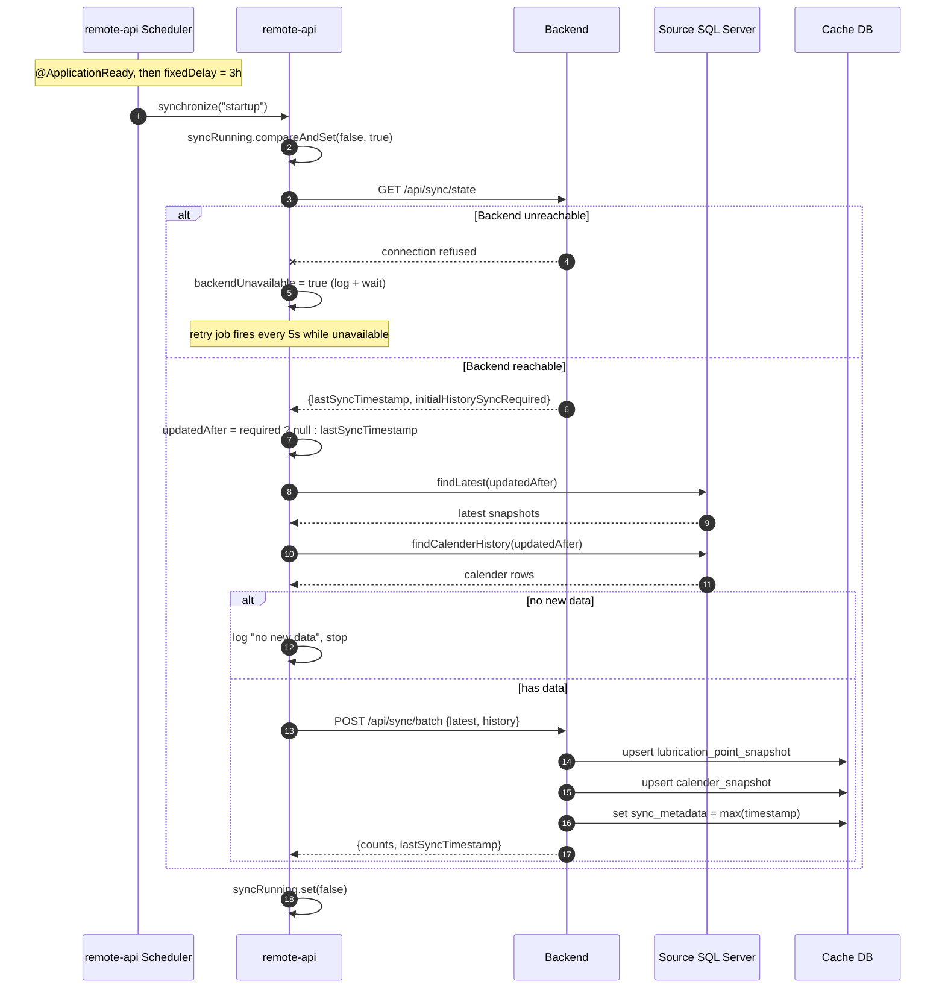

### 9.2 Technician views a lubrication point

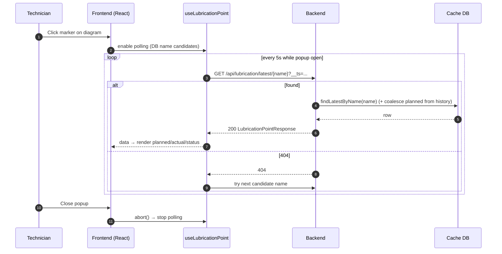

### 9.3 Fleet dashboard aggregation

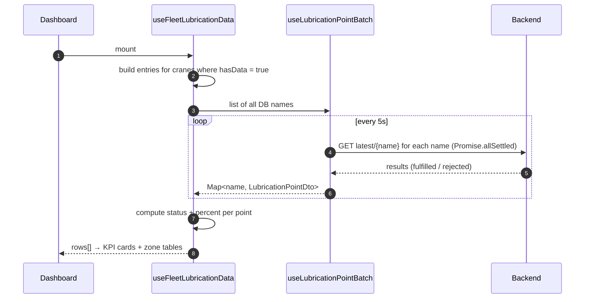

### 9.4 Startup & first-run history backfill

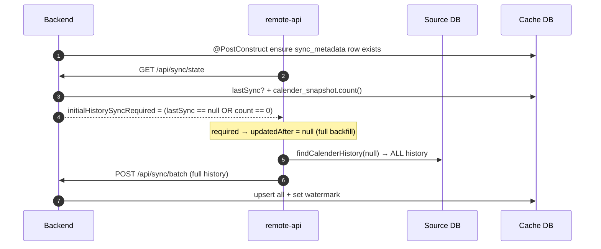

---

## 10. Frontend Architecture

### 10.1 Routing model

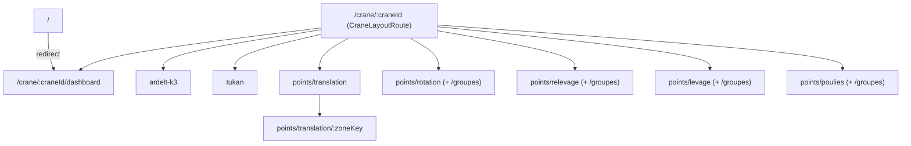

### 10.2 Layered structure
- **Routes** (`routes/`, `App.tsx`) — page composition per crane subsystem.
- **Components** — `diagram/` (interactive diagram engine), `dashboard/` (fleet KPIs, zone tables, critical points), `layout/` (header, sidebar, navigation).
- **Hooks** — data fetching/polling (`useLubricationPoint`, `useLubricationPointBatch`, `useFleetLubricationData`), UI (`useCountUp`, `useOutsideClick`, `useSequentialNavigation`, `useCrane`).
- **Config** — `cranesConfig` (fleet definitions), diagram `zones/` (marker catalog + coordinate profiles + overrides + registry), `navigation`.
- **Services** — `lubricationApi.ts` (fetch wrapper + typed error).
- **Types** — `lubricationPoint.ts`, `diagram/types.ts`.

### 10.3 Configuration-driven diagram engine
Rather than hand-coding every diagram, the system composes them:

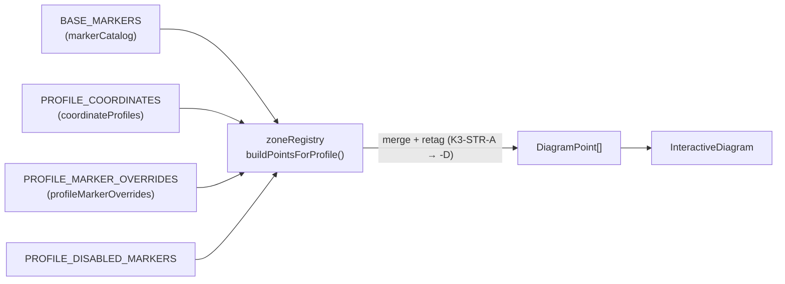

`buildPointsForProfile` filters disabled markers, merges base + override + coordinates, and rewrites tag letters per zone — so one catalog drives many zone variants.

### 10.4 InteractiveDiagram capabilities
- Percent-positioned clickable markers over a crane image.
- Wheel zoom (1×–3×) and click-drag pan.
- Batch data fetch for all visible markers; per-popup live polling with `AbortController` and a request-sequence guard to discard stale responses.
- Popup `LubricationInfoCard` showing identifiers, frequency, planned amount, live actual vs planned, and status.

---

## 11. Business Logic & Rules

### 11.1 Status resolution (`diagramPointUtils.ts`)

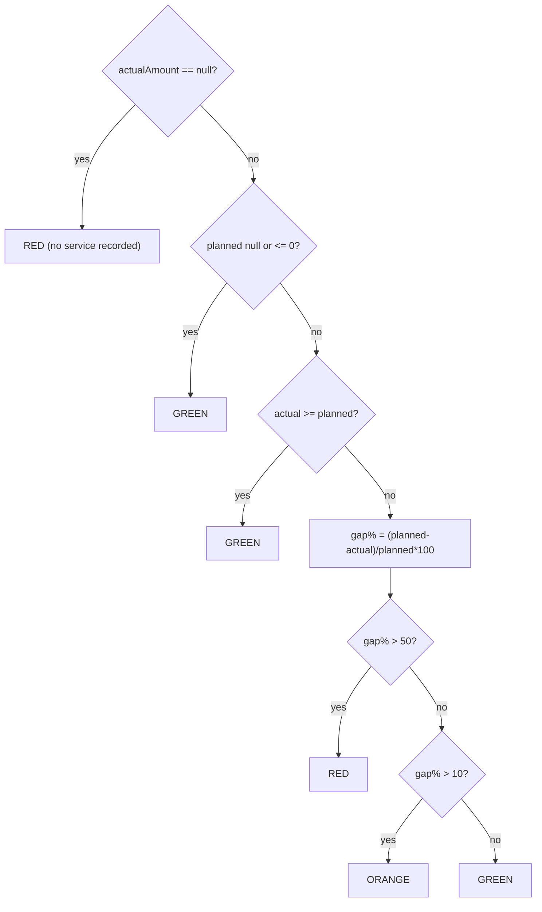

### 11.2 Rules summary
| Rule | Definition |
|---|---|
| **Critical point** | `actual` is null, OR (`planned > 0` AND `actual < planned × 0.5`). |
| **Percent applied** | `null` if no actual; `100` if no planned; else `min(100, actual/planned × 100)`. |
| **Status colors** | RED = no actual or gap > 50% · ORANGE = gap 10–50% · GREEN = gap ≤ 10% or fully served. |
| **DB name resolution** | Marker → candidate DB names via `dbName`/`tagPrimary`/`tagSecondary` matched against `K3/T2-(STR|SROT|FLECHE|SLEV|POULIE)-...` pattern; candidates tried in order. |

### 11.3 Incremental sync rule
`updatedAfter` watermark = `Calender.TimeStamp`. Steady-state syncs transfer only rows newer than the last watermark. **Documented limitation:** source updates that do not change `TimeStamp` are not detected.

---

## 12. Resilience, Security & Configuration

### 12.1 Resilience patterns
- **Non-overlapping sync** — `AtomicBoolean syncRunning` with `compareAndSet` blocks concurrent runs (startup vs scheduled vs retry).
- **Reconnection** — `retryBackendConnection()` fires every 5 s, but only acts while `backendUnavailable` is set; auto-resumes when the backend returns.
- **Incremental + first-run backfill** — watermark for steady state; `initialHistorySyncRequired` forces full history when the cache is empty.
- **Idempotent ingest** — upserts keyed by PK; safe to replay batches.
- **Self-migrating schema** — idempotent T-SQL on startup.

### 12.2 Configuration (externalized)
- Secrets via `.env` (`DB_URL`, `DB_USERNAME`, `DB_PASSWORD`) imported by `spring.config.import` (searches `./.env` and `../.env`).
- Tunables: `REMOTE_SYNC_INTERVAL_MS` (default 3h), `REMOTE_SYNC_RETRY_MS` (5s), backend timeouts, Hikari pool size/idle.
- CORS restricted to `http://localhost:5173` and `:4173` for `/api/**`.
- Frontend reaches the backend through the Vite dev proxy (`/api` → `:8081`).

### 12.3 Security posture
- **No authentication/authorization** on any endpoint — acceptable for an internal LAN tool but a known gap.
- `trustServerCertificate=true` in JDBC URLs — convenient for dev, not for production TLS validation.
- Polled read endpoint hardened against caching (`no-store`).

---

## 13. Code Metrics

| Metric | Value |
|---|---|
| Java LOC | ~1,178 |
| Java files | 36 |
| Frontend TS/TSX LOC | ~5,748 |
| Frontend TS/TSX files | 82 |
| Backend services | 3 (remote-api, Backend, frontend) |
| Automated tests | **0** |
| Cranes configured | 5 (2 with live data: KRANBAU, TUKAN) |

---

## 14. Strengths, Weaknesses & Recommendations

### 14.1 Strengths
1. **Real industrial problem with real constraints**; the cache-and-sync architecture is the correct, well-justified response.
2. **Clean layered design** (Controller → Service → Repository), constructor injection, immutable record DTOs.
3. **Unidirectional, isolated data flow** — frontend and backend never touch the source DB.
4. **Production-minded resilience** — atomics, retry/reconnect, incremental sync, idempotent ingest, self-migrating schema.
5. **Non-trivial SQL** — `OUTER APPLY` lateral joins with NULL-aware ordering and planned-amount coalescing.
6. **Sophisticated config-driven frontend** — the marker/profile/zone composition engine is a genuine design achievement.
7. **Thorough documentation** (README) that even states known limitations honestly.

### 14.2 Weaknesses
1. **No automated tests** in any layer — the single biggest gap.
2. **DTO duplication** across services with no shared module — silent break risk.
3. **No authentication/authorization**.
4. **Polling-based frontend** (5 s, per-marker, N individual GETs) — won't scale; no batch read endpoint.
5. **Sync watermark depends solely on `Calender.TimeStamp`** — documented correctness hole.
6. **Partial data coverage** — only 2 of 5 cranes wired with real data.
7. **Build reproducibility risk** — Vite 8 beta pinned; `target/` artifacts committed.

### 14.3 Recommendations (priority order)
1. **Add a test layer:** unit-test `resolveLubricationStatus` / `isCriticalLubricationPoint`; `@DataJpaTest` for native queries; a `DataSyncService.ingest` test proving watermark advance + idempotent upsert.
2. **Introduce a batch read endpoint** (`GET /api/lubrication/latest?names=...`) to cut polling cost.
3. **Extract shared DTOs** into a common module/contract.
4. **Add authentication** (even basic) before any non-LAN deployment.
5. **Document/strengthen the sync watermark** (e.g. a dedicated change-tracking column) if source updates can occur without `TimeStamp` changes.
6. **Pin a stable Vite release** and remove build artifacts from version control.

---

## 15. Glossary

| Term | Meaning |
|---|---|
| **Lubrication point** | A specific location on a crane requiring grease. |
| **Planned amount** | Grease quantity prescribed for a point. |
| **Actual amount** | Grease quantity actually applied. |
| **Watermark (`updatedAfter`)** | Timestamp marking the last successful sync; only newer source rows are fetched. |
| **Snapshot** | Cached "latest state" of a point. |
| **Calender** | Source table of time-stamped lubrication events (original spelling preserved). |
| **Translation / Rotation / Relevage / Levage / Poulies** | Crane subsystems (travel / slew / boom luffing / hoisting / cable pulleys). |
| **Drive groups (*groupes d'entraînement*)** | Motor/gearbox assemblies within a subsystem. |

---

*End of report.*
